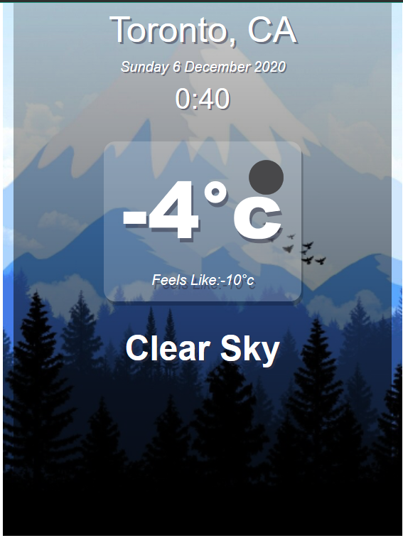
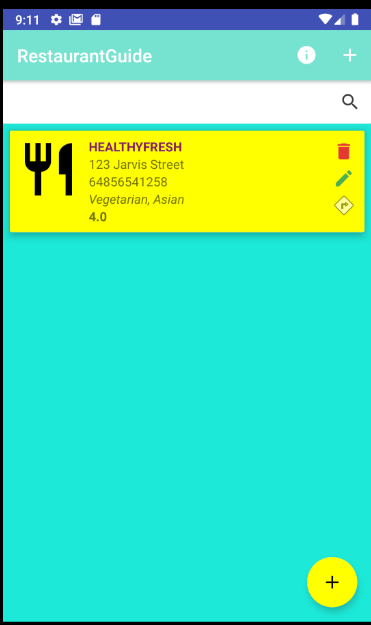

# Minh Quang Truong Portfolio

## I. Personal Data


### 1. Bio

### 2. Cover Letter
[Link to cover letter](https://drive.google.com/file/d/1gy76HUFjp9j5KBldNUAaEybaTmULM8PR/view?usp=sharing)
### 3. Resume
[Link to resume](https://drive.google.com/file/d/1c4OMeSB0WLcc-zvif1cS6mECc-cZL9ZM/view?usp=sharing)

### 4. Philosophy
## II. Academic credentials
*September 2018 - April 2021*

```javascript
Diploma, George Brown College, GPA 3.9
T127, Computer Programer Analyst
```

## III. Academic work experience
### Academic work samples:
#### 1. Weather application: [Link to source code](https://github.com/minhquangtruong/101160445_comp3123_a2)
**Technology used: [React-Native Framework](https://reactnative.dev/)**
>This is an application that update the current weather conditions (temperature, precipitation, humidity, …) by displaying the data from an API call of  https://openweathermap.org/api



#### 2 . Machine learning project 1: [Link to source code](https://colab.research.google.com/drive/1YZt6svHcogQsq6lW9OjaLStMCtclsvYA?usp=sharing)
**Technology used: [Google collab](https://colab.research.google.com)**

>A machine learning project that identifies images of fashion icons with 90%+ accuracy using model from Keras.

**Demonstation video:**
<a href="http://www.youtube.com/watch?feature=player_embedded&v=9shEro6sy_k
" target="_blank"></a>

#### 3 . Machine learning project 2: [Link to source code](https://colab.research.google.com/drive/1PZlJcb1gijXOl22ZzfcVYm2KPYOa4jkf?usp=sharing)
**Technology used: [Google collab](https://colab.research.google.com)**

>This project uses machine learning to implement a multiclass classification using Iris classical dataset. The idea is to intensify what I have learned from the first project

**Demonstation video:**
<a href="http://www.youtube.com/watch?feature=player_embedded&v=eXkV_b-vmdo
" target="_blank"></a>

#### 1. Restaurant Guide: [Link to source code](https://github.com/minhquangtruong/101160445_comp3123_a2)
**Technology used: [Android Studio](https://developer.android.com/studio)**
>This is an Android application capable of CRUD (Create, Read, Update, Delete) restaurant information using SQLite. You can bookmark your favorite restaurant and get direction from your current location.



### Captone Project:


## IV. Professional summary
### Awards and Reconigtion:
**Dean’s Honors List on all of the semester**:

